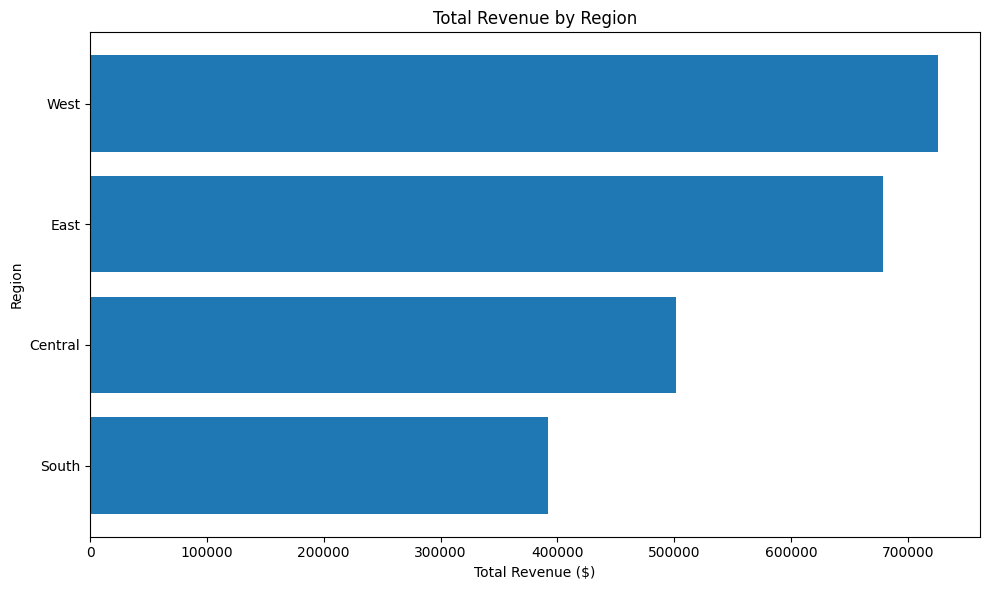
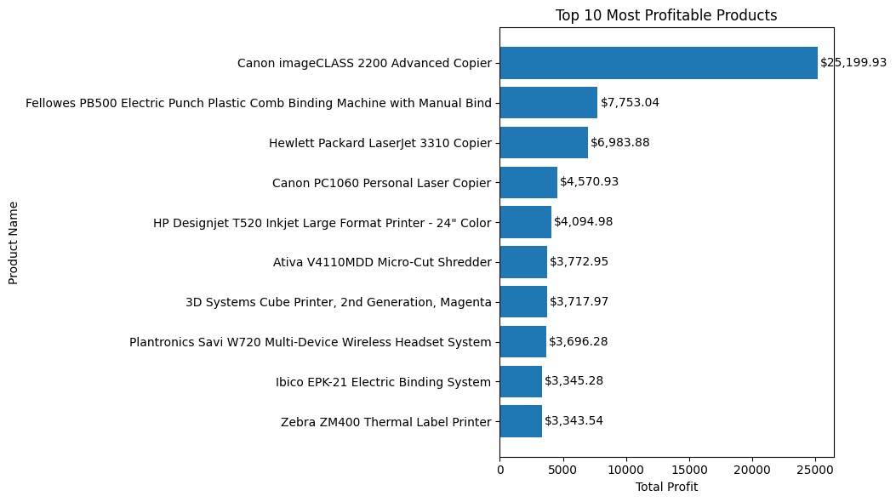
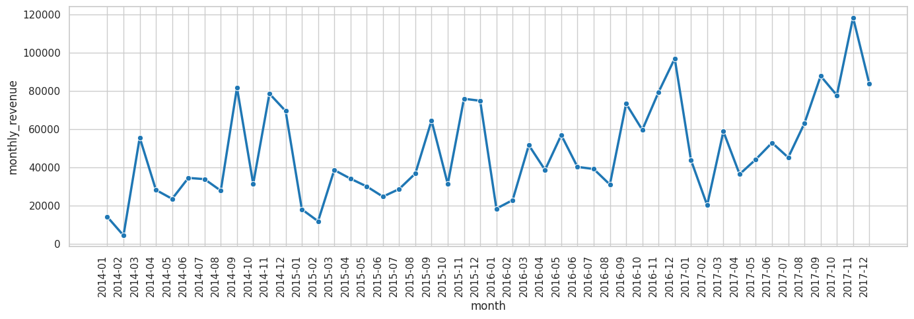

# Retail BI Pipeline 🛒📊

An end-to-end automated business intelligence pipeline built in Python. Takes raw retail sales data, cleans it, loads it into a SQLite database, runs SQL-driven business queries, and outputs automated reports with charts — all in under a few seconds.

---

## The Problem

Retail businesses often have messy, inconsistent CSV exports sitting in spreadsheets. Turning that raw data into actionable business insights — revenue by region, top products, monthly trends — requires hours of manual work in Excel every time. This pipeline automates that entire process.

---

## Pipeline Overview

```
Raw CSV  →  cleaner.py  →  clean CSV  →  db_loader.py  →  SQLite DB  →  report_gen.py  →  Charts + CSV Reports
```

**Run the full pipeline in 3 commands:**

```bash
python cleaner.py
python db_loader.py
python report_gen.py
```

---

## What Each Script Does

### `cleaner.py`
- Loads raw CSV with encoding handling (`latin-1`)
- Drops duplicate rows
- Strips whitespace from all string columns
- Normalizes all column names to `snake_case`
- Converts `order_date` and `ship_date` to proper datetime format
- Saves clean data to `data/clean/clean.csv`

### `db_loader.py`
- Connects to (or creates) a SQLite database at `data/retail.db`
- Loads the entire cleaned DataFrame into a `sales` table
- Verifies row count on completion

### `report_gen.py`
Runs 5 business intelligence SQL queries and outputs results as CSVs and charts:

| Query | Output |
|---|---|
| Revenue & profit by region | `regional_revenue_and_profit.csv` |
| Top 10 most profitable products | `top_10_products_by_profit.csv` |
| Monthly sales trend (2014–2017) | `revenue_by_months.csv` |
| Category-wise profit margin % | `category_sales_profit_margin.csv` |
| Discount impact on average profit | `discount_impact_on_profit.csv` |

---

## Business Insights from the Data

**Revenue by Region**

West leads with $725K in revenue, but South has a stronger profit-to-revenue ratio than Central despite lower total sales.



---

**Top 10 Most Profitable Products**

Canon imageCLASS 2200 Advanced Copier dominates at $25,199 in total profit — nearly 3x the second-place product.



---

**Monthly Sales Trend**

Clear upward growth from 2014 to 2017, with strong Q4 spikes each year consistent with holiday retail patterns.



---

**Key Finding — Discount Impact**

| Discount Level | Avg Profit per Order |
|---|---|
| 0% | +$66.90 |
| 20% | +$24.70 |
| 30% | **-$50.24** |
| 50% | **-$298.70** |

Discounts above 20% consistently produce negative profit. Any discount strategy above that threshold is losing the business money on every order.

---

## Tech Stack

- **Python 3** — core language
- **Pandas** — data cleaning and transformation
- **SQLite3** — embedded database (no server required)
- **Matplotlib / Seaborn** — visualization
- **Jupyter Notebook** — exploratory data analysis

---

## Project Structure

```
Retail_BI_Pipeline/
│
├── data/
│   ├── raw/                  ← original Kaggle CSV
│   └── clean/                ← cleaner.py output
│
├── reports/
│   ├── *.csv                 ← 5 SQL query result exports
│   └── charts/               ← 3 PNG visualizations
│
├── exploration.ipynb         ← EDA and cleaning prototyping
├── cleaner.py                ← data cleaning script
├── db_loader.py              ← SQLite loader
├── report_gen.py             ← SQL reporting + visualization
├── requirements.txt
└── README.md
```

---

## Setup & Usage

```bash
# Clone the repo
git clone https://github.com/Kapilbhadu0017/Retail_BI_Pipeline.git
cd Retail_BI_Pipeline

# Create and activate virtual environment
python3 -m venv venv
source venv/bin/activate

# Install dependencies
pip install -r requirements.txt

# Add the Superstore dataset to data/raw/
# Download from: https://www.kaggle.com/datasets/vivek468/superstore-dataset-final

# Run the pipeline
python cleaner.py
python db_loader.py
python report_gen.py
```

---

## Dataset

[Superstore Sales Dataset](https://www.kaggle.com/datasets/vivek468/superstore-dataset-final) — 9,994 retail orders across US regions (2014–2017), sourced from Kaggle.

---

*Part of my data automation portfolio. Built with Python, SQL, and zero Excel.*